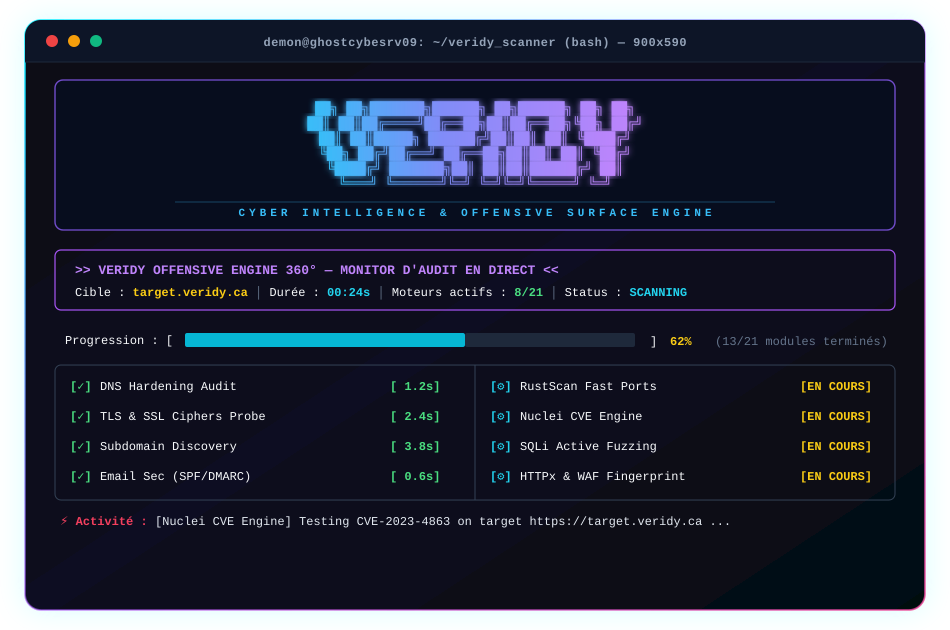

<p align="center">
  
</p>

<p align="center">
  
  
  
  
  
  
</p>

---

# 🛡️ VERIDY — Cyber Intelligence & Offensive Surface Engine 360°

> **Moteur modulaire d'audit de sécurité offensif et de cartographie de surface d'attaque.**  
> Conçu pour être exécuté aussi bien par un **opérateur humain** (TUI interactif) que par un **agent IA autonome** en ligne de commande (CLI / JSON natif).

---

## 📦 Installation

### Méthode 1 — Cargo (crates.io) ✅

```bash
cargo install veridy_scanner
veridy_scanner example.com --fast --json
```

### Méthode 2 — Script d'installation automatique (Kali / Debian / Arch)

```bash
curl -fsSL https://raw.githubusercontent.com/DeamonDev888/veridy-scanner/main/install.sh -o /tmp/install.sh
sudo bash /tmp/install.sh
```

Le script installe : le binaire (`/usr/local/bin`), le wrapper `veridy` (TUI), les dépendances système optionnelles (nmap, nuclei, nikto…), les wordlists SecLists et le schéma PostgreSQL complet (12 tables `audit_*`).

Variables surchargeables : `VERIDY_INSTALL_DIR`, `VERIDY_BRANCH`, `VERIDY_DB`.

### Méthode 3 — Compilation depuis les sources

```bash
git clone https://github.com/DeamonDev888/veridy-scanner.git
cd veridy-scanner
cargo build --release

# Déploiement global
sudo cp target/release/veridy_scanner /usr/local/bin/veridy_scanner
sudo cp launch.sh /usr/local/bin/veridy
sudo chmod +x /usr/local/bin/veridy /usr/local/bin/veridy_scanner
```

## ⚙️ Prérequis — outils Kali REQUIS

L'audit Veridy est **exhaustif par défaut** : le scanner active les 14 outils Kali standards automatiquement et **refuse de démarrer** si un outil est absent — pas de scan léger silencieux pour le moment. Un environnement incomplet produirait un audit trompeur.

| Outil | Installation |
|---|---|
| nmap, nikto, sslscan, dnsrecon, theharvester | `apt install <outil>` |
| nuclei | `apt install nuclei` · [github.com/projectdiscovery/nuclei](https://github.com/projectdiscovery/nuclei) |
| wafw00f | `apt install wafw00f` · `pip install wafw00f` |
| whatweb | `apt install whatweb` · `gem install whatweb` |
| dnstwist | `apt install dnstwist` · `pip install dnstwist` |
| ffuf | `apt install ffuf` · [github.com/ffuf/ffuf](https://github.com/ffuf/ffuf) |
| httpx, subfinder, rustscan | `go install github.com/projectdiscovery/httpx@latest` (idem subfinder, RustScan) |
| obscura | Voir [Installation](#-installation) |

Également requis : Rust ≥ 1.75, `openssl`, `curl`, `dig` (dnsutils), `whois`. PostgreSQL 12+ optionnel (`--no-db` sinon).

Diagnostic : `veridy_scanner tools` (CLI) ou `./launch.sh --check-tools` (TUI).

> `--fast` (Core Rust uniquement) reste disponible en opt-out explicite pour les environnements restreints.

---

## 🤖 Guide Spécifique pour Agents IA & Automatisation CLI

> [!IMPORTANT]
> **Règle d'or pour les agents autonomes** :
> - Ne lancez **JAMAIS** `veridy` sans argument en script automatisé : cela déclenche la console TUI interactive qui attend des pressions de touches (`stdin`).
> - Pour une utilisation automatisée, utilisez directement `veridy_scanner` ou le wrapper `veridy` avec une **cible explicite** et des options CLI.
> - Utilisez le flag `--json` (ou `-j`) pour obtenir une sortie structurée directement exploitable par vos fonctions ou via `jq`.

### 1. Commandes Recommandées pour Agents (Mode Non-Interactif)

```bash
# ⚡ 1. Audit rapide Core Rust (~1.5s) avec sortie JSON pure :
veridy_scanner example.com --fast --json

# 🌐 2. Audit de surface web standard (WAF + Tech + TLS + Typo) :
veridy_scanner example.com --web --json

# 👑 3. Audit exhaustif 360° (Tous les 15 outils Kali) :
veridy_scanner example.com --full --json

# 🔬 4. Lancement ciblé de modules précis :
veridy_scanner example.com --nmap --nuclei --json
veridy_scanner example.com -m rustscan,httpx,waf --json

# 🗄️ 5. Consultation de l'historique PostgreSQL (10 derniers audits) :
veridy_scanner history 10

# 🛠️ 6. Vérification de l'environnement et disponibilité des outils :
veridy_scanner tools
```

### 2. Extraction & Parsing JSON pour Agents (`jq`)

Lorsque le flag `--json` est actif, le TUI est désactivé et `veridy_scanner` émet un objet JSON strict sur `stdout` :

```bash
# Récupérer uniquement le score global (0 à 100) :
veridy_scanner example.com -1 -j | jq '.overall_score'

# Extraire les vulnérabilités de sévérité CRITICAL ou HIGH :
veridy_scanner example.com -3 -j | jq '.findings[] | select(.severity == "CRITICAL" or .severity == "HIGH")'

# Lister tous les ports ouverts découverts :
veridy_scanner example.com -1 -j | jq '.ports.open_ports'

# Vérifier la présence d'une politique SPF / DMARC valide :
veridy_scanner example.com -1 -j | jq '{spf: .email_sec.has_spf, dmarc: .email_sec.has_dmarc}'
```

### 3. Matrice des Arguments & Codes de Retour (CLI Matrix)

| Argument / Flag | Description pour l'Agent | Temps Moyen | Dépendances |
|---|---|:---:|:---:|
| `-1`, `--fast` | Scan natif pur Rust (Ports, TLS, DNS, GéoIP) | ~1.5s | Zéro (Rust pur) |
| `-2`, `--web` | WAFW00F, WhatWeb, SSLScan, Dnstwist | ~7s | Python / Ruby / C |
| `-3`, `--full` | **Audit complet 360°** (15 modules Kali activés) | ~60-90s | Suite Kali |
| `-4`, `--infra` | Nmap (-sV -sC) + SSLScan | ~25s | nmap, sslscan |
| `-5`, `--vuln` | Nuclei (templates CVEs) + Nikto + Nmap | ~45s | nuclei, nikto |
| `-d`, `--discovery`| Ffuf (SecLists) + Nikto + Wafw00f | ~40s | ffuf, nikto |
| `-j`, `--json` | **Désactive le TUI** et émet du JSON machine | - | - |
| `--no-db` | Désactive la persistance PostgreSQL (mode éphémère) | - | - |
| `--timeout <MS>` | Ajuste le timeout TCP (défaut : 800 ms) | - | - |

**Codes de sortie (`Exit Codes`) :**
- `0` : Audit exécuté avec succès, rapport généré.
- `1` : Erreur d'arguments CLI, cible invalide/non résoluble, ou échec de connexion critique.

---

## ⚡ Aperçu du Terminal TUI (Mode Interactif pour Humains)

Pour un utilisateur en direct sur le serveur Kali, `veridy` propose une console cyberpunk riche avec monitoring des threads en direct :

<p align="center">
  
</p>

---

## 🔬 Les 15 Modules Spécialisés Embarqués

1. **Nmap** : Reconnaissance fine des bannières de services et scripts de vulnérabilités NSE.
2. **Nuclei** : Détection active de CVEs et failles applicatives via templates YAML.
3. **Nikto** : Audit des configurations de serveurs HTTP et fichiers sensibles.
4. **Wafw00f** : Empreinte de pare-feux applicatifs (Cloudflare, AWS WAF, Imperva, etc.).
5. **WhatWeb** : Analyse des stacks web (CMS, frameworks JS, serveurs, fuites emails).
6. **SSLScan** : Solidité des suites de chiffrement TLS 1.0 à 1.3 et failles (Heartbleed, etc.).
7. **Dnstwist** : Détection d'attaques par usurpation, phishing et typosquatting.
8. **Ffuf** : Fuzzing haute vitesse des routes web masquées via dictionnaires SecLists.
9. **Whois** : Analyse des registres officiels (CIRA/ICANN), contacts et dates d'expiration.
10. **Dnsrecon** : Cartographie des enregistrements SRV, serveurs NS et transferts de zone.
11. **theHarvester** : Reconnaissance OSINT d'adresses emails publiques et sous-domaines.
12. **Obscura** : Moteur Headless Browser V8, analyse dynamique du DOM et screenshot PNG.
13. **RustScan** : Balayage SYN ultra-rapide des 65535 ports réseau.
14. **HTTPx** : Probing HTTP/HTTPS massif et stack technologique des sous-domaines.
15. **SQLMap** : Détection automatisée d'injections SQL sur les routes paramétrées (opt-in explicite `--sqli`).

---

## 🧪 Modules Core Rust Natifs

| Module | Ce qu'il fait |
|---|---|
| `dns` | A/AAAA/MX/NS/TXT/SOA/CAA/DMARC + DNSSEC (flag AD) |
| `email_sec` | SPF (RFC 7208), DKIM, DMARC, MTA-STS, TLS-RPT, BIMI |
| `ports` | Scan TCP (pool borné 24 workers) + bannières de services, 75+ ports |
| `tls` | Chaîne X.509, expiration, SANs, ALPN (h2), auto-signé, protocoles obsolètes |
| `http` | En-têtes de sécurité (HSTS/CSP/XFO/...), cookies, redirection HTTPS |
| `web_endpoints` | security.txt, robots.txt, méthodes HTTP |
| `subdomains` | Énumération (subfinder + liste), vivant/muet, CNAME takeover (19 clouds) |
| `vuln_audit` | Libs obsolètes, SRI, mixed content, CORS, secrets exposés |
| `geo` | Whois IP : ASN, org, pays, région |

**Qualité** : 66 tests unitaires · clippy 0 warning · timeouts globaux sur tous les sous-processus · `catch_unwind` sur tous les threads · persistance PostgreSQL atomique · aucun `sh -c` (arguments directs, zéro injection shell).

---

## 🗄️ Base PostgreSQL (optionnelle)

```bash
createdb veridy_audit
psql -d veridy_audit -f init_schema.sql
psql -d veridy_audit -f schema_full.sql
psql -d veridy_audit -f schema_deep.sql
psql -d veridy_audit -f schema_tools.sql
```

12 tables relationnelles `audit_*` : scans, findings, ports, headers, certificats TLS, sous-domaines, géo, email, endpoints, durcissement DNS, sorties d'outils. Sinon, `--no-db` pour le mode éphémère.

---

## ⚖️ Avertissement

Outil d'audit offensif destiné aux professionnels de la sécurité. À utiliser **uniquement sur des systèmes pour lesquels vous disposez d'une autorisation explicite**. L'opérateur est responsable de la conformité de ses scans à la loi applicable.

---

<p align="center">
  
  <br>
  <sub>Moteur d'audit offensif automatisé · Surface d'attaque 360° · Rust natif</sub>
</p>
